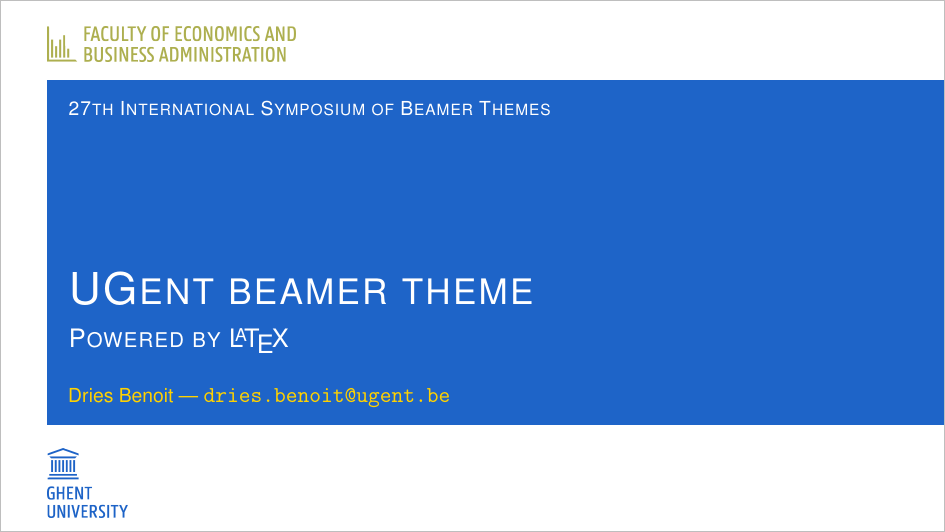
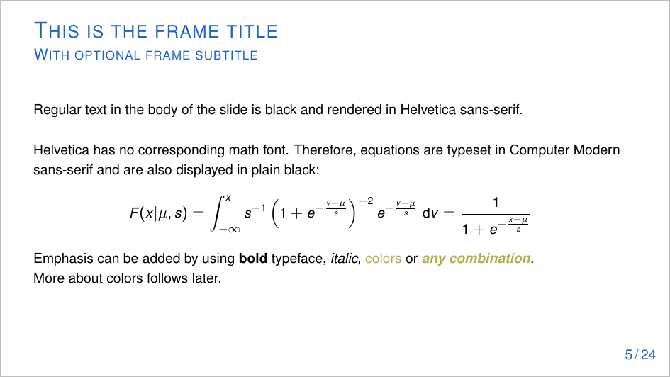
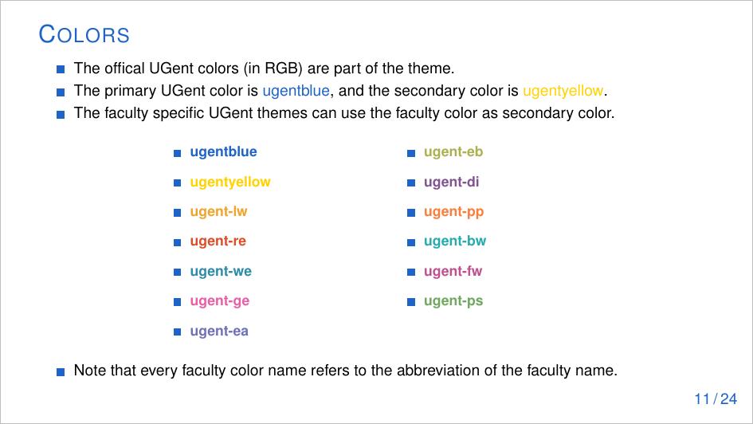
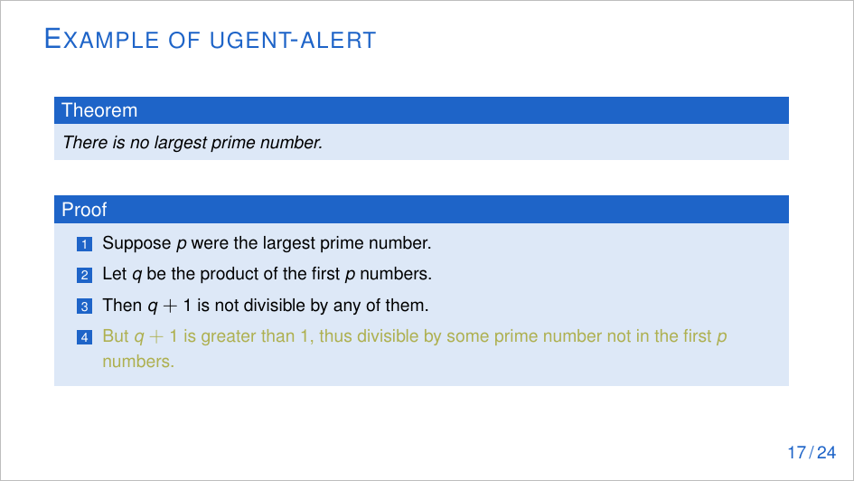
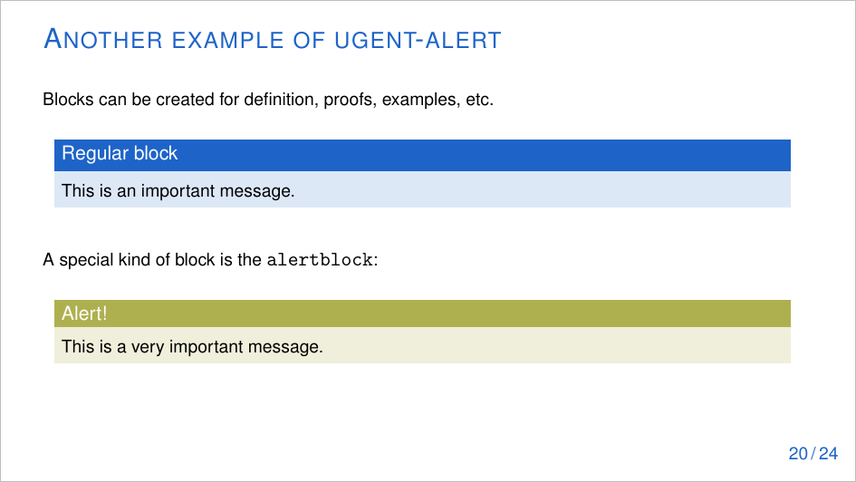

# Version v0.1-1

The aim of this UGent Beamer theme:
* A theme that closely resembles the official UGent Powerpoint/Keynote presentation themes.
* Similar theme options as the [depreciated UGent Beamer theme](https://github.com/pbelmans/ugent-beamer) by Pieter Belmans.
* A corporate version, as well as faculty specific versions.
* Ease-of-use for the average Beamer user.

Requires the packages [sfmath](https://ctan.org/pkg/sfmath),[helvet](https://ctan.org/pkg/helvet), [PGF/TikZ](https://ctan.org/pkg/pgf) and [beamer](https://ctan.org/pkg/beamer) to be installed in your LaTeX distribution.

## Usage

After downloading this repository, you can immediately start working by editing the provided presentation.tex template.

You can also install the style globally. Once you have the files, all that is required for the theme to work is putting the files into a directory where LaTeX can find them. This boils down to mimicking the so called TDS (or TeX Directory Structure). In case you're using your favorite flavor of Unix (and/or TeX Live) you need to have a local directory (this will probably be ~/texmf/) and you need to place all the files from the theme folder in the directory ~/texmf/tex/latex/beamer/themes/ugent/, finishing it by running texhash. If on the other hand you're on Windows (probably MiK\TeX) the walkthrough at [this url](http://docs.miktex.org/manual/localadditions.html) explains in detail how to create a local installation. Don't forget to Refresh FNDB as explained [here](http://docs.miktex.org/manual/configuring.html#fndbupdate).

### Theme options

The theme options can be set as follows:
`\usetheme[optionshere]{ugent}`

* `language=x`, where x is the language
  * `nl`: dutch (default)
  * `en`: english
* `faculty=x`, where x is the abbreviation of the faculty
  * `lw`: Faculty of Literature & Philosophy
  * `re`: Faculty of Law
  * `we`: Faculty of Science
  * `ge`: Faculty of Medicine and Health Sciences
  * `ea`: Faculty of Engineering and Architecture
  * `eb`: Faculty of Economics and Business Administration
  * `di`: Faculty of Veterinary Medicine
  * `pp`: Faculty of Psychology and Educational Sciences
  * `bw`: Faculty of Bioscience Engineering
  * `fw`: Faculty of Pharmaceutical Sciences
  * `ps`: Faculty of Political and Social Sciences
* `usecolors`
  * This option sets the secondary color equal to the faculty color
  * Always use in combination with `faculty=x`
* `noframenumber`
  * This option suppresses the frame numbers
  
### Frame macros

Some frames can be generated automatically:
* `\logoframe`: a white frame with large UGent logo
* `\titleframe`: the title frame
* `\sectionframe`: frame that shows the current section

## Contact

Having trouble using this style? Did you find a bug? Would you like a new feature in this style? Please submit a Github Issue. 

## Example slides

